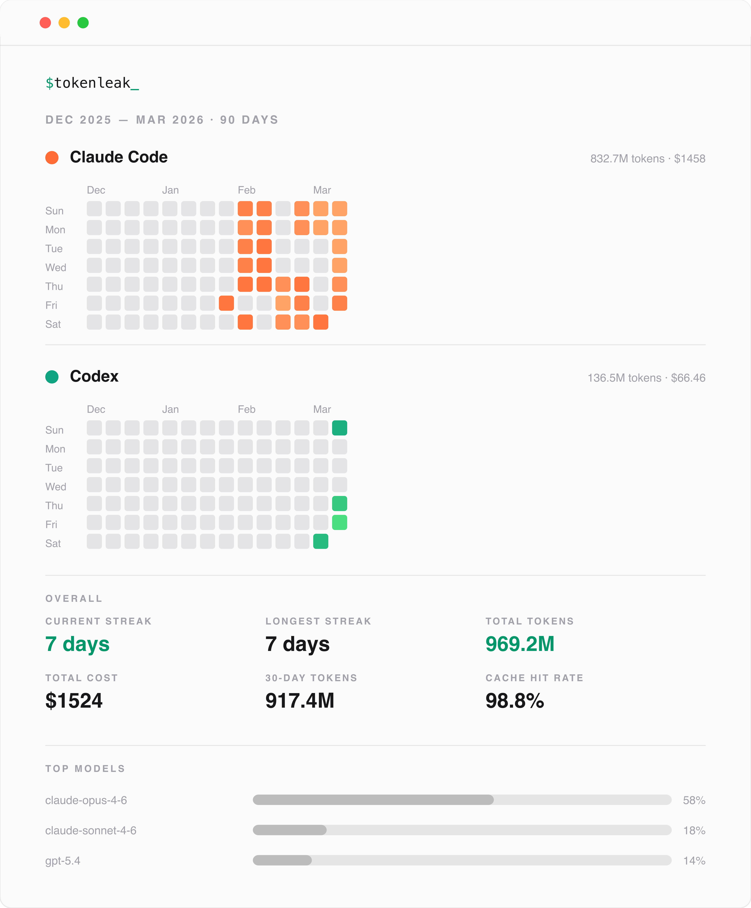

# Tokenleak

See where your AI tokens actually go. Tokenleak reads local usage logs from **Claude Code**, **Codex**, and **Open Code**, then renders heatmaps, dashboards, and shareable cards — all from your terminal.



## Install

Tokenleak requires [Bun](https://bun.sh) (v1.0+).

```bash
bun install -g tokenleak
```

After installing, run `tokenleak` in your terminal. It will automatically detect which AI coding tools you have installed and display your usage.

### From source

```bash
git clone https://github.com/ya-nsh/tokenleak.git
cd tokenleak
bun install
bun run build
bun run bundle

# Run directly
bun dist/tokenleak.js
```

## Usage

```bash
# Show a terminal dashboard of your token usage (default)
tokenleak

# Output as JSON
tokenleak --format json

# Export an SVG heatmap
tokenleak --format svg --output usage.svg

# Export a PNG image
tokenleak --format png --output usage.png

# Save to a file (format is inferred from the extension)
tokenleak -o report.json
tokenleak -o heatmap.svg
tokenleak -o card.png
```

### Date filtering

By default, Tokenleak shows the last **90 days** of usage.

```bash
# Last 30 days
tokenleak --days 30

# Specific date range
tokenleak --since 2025-06-01 --until 2025-12-31

# Everything since a date (until defaults to today)
tokenleak --since 2025-01-01

# --since takes priority over --days when both are provided
```

### Provider filtering

Tokenleak auto-detects all installed providers. You can filter to specific ones:

```bash
# Only Claude Code
tokenleak --provider claude-code

# Only Codex
tokenleak --provider codex

# Multiple providers (comma-separated)
tokenleak --provider claude-code,codex
```

### Compare mode

Compare your usage across two time periods to see how your token consumption has changed:

```bash
# Auto-compare: splits your date range in half
# (e.g. with --days 60, compares last 30 days vs. previous 30 days)
tokenleak --compare auto

# Compare against a specific previous period
tokenleak --compare 2025-01-01..2025-03-31

# Compare outputs deltas for total tokens, cost, streaks, etc.
tokenleak --compare auto --format json
```

Compare mode outputs a JSON object with `currentPeriod`, `previousPeriod`, and `deltas` showing the difference between the two periods (positive = increase, negative = decrease).

### Themes

```bash
# Dark theme (default)
tokenleak --theme dark

# Light theme
tokenleak --theme light
```

### Terminal options

```bash
# Set terminal width (affects heatmap and dashboard layout)
tokenleak --width 120

# Disable ANSI colours (useful for piping output)
tokenleak --no-color

# Hide the insights panel
tokenleak --no-insights
```

### Sharing

```bash
# Copy rendered output to clipboard
tokenleak --format json --clipboard

# Open the output file in your default application after saving
tokenleak -o usage.svg --open

# Upload to a GitHub Gist (requires gh CLI to be authenticated)
tokenleak --format json --upload gist
```

## All flags

| Flag            | Alias | Default    | Description                                                     |
| --------------- | ----- | ---------- | --------------------------------------------------------------- |
| `--format`      | `-f`  | `terminal` | Output format: `json`, `svg`, `png`, `terminal`                 |
| `--theme`       | `-t`  | `dark`     | Colour theme: `dark`, `light`                                   |
| `--since`       | `-s`  |            | Start date (`YYYY-MM-DD`). Overrides `--days`                   |
| `--until`       | `-u`  | today      | End date (`YYYY-MM-DD`)                                         |
| `--days`        | `-d`  | `90`       | Number of days to look back                                     |
| `--output`      | `-o`  | stdout     | Output file path. Format is inferred from extension             |
| `--width`       | `-w`  | `80`       | Terminal width for dashboard layout                             |
| `--no-color`    |       | `false`    | Strip ANSI escape codes from terminal output                    |
| `--no-insights` |       | `false`    | Hide the insights panel                                         |
| `--compare`     |       |            | Compare two date ranges. Use `auto` or `YYYY-MM-DD..YYYY-MM-DD` |
| `--provider`    | `-p`  | all        | Filter to specific provider(s), comma-separated                 |
| `--clipboard`   |       | `false`    | Copy output to clipboard after rendering                        |
| `--open`        |       | `false`    | Open output file in default app (requires `--output`)           |
| `--upload`      |       |            | Upload output to a service. Supported: `gist`                   |
| `--version`     |       |            | Print version number                                            |
| `--help`        |       |            | Print usage information                                         |

## Supported providers

### Claude Code

Reads JSONL conversation logs from the Claude Code projects directory. Each assistant message with a `usage` field is parsed for input/output/cache token counts.

|                   |                                              |
| ----------------- | -------------------------------------------- |
| **Data location** | `~/.claude/projects/*/*.jsonl`               |
| **Override**      | Set `CLAUDE_CONFIG_DIR` environment variable |
| **Provider name** | `claude-code`                                |

### Codex

Reads JSONL session logs from the Codex sessions directory. Parses `response` events for token usage with cumulative delta extraction.

|                   |                                       |
| ----------------- | ------------------------------------- |
| **Data location** | `~/.codex/sessions/*.jsonl`           |
| **Override**      | Set `CODEX_HOME` environment variable |
| **Provider name** | `codex`                               |

### Open Code

Reads usage data from the Open Code SQLite database. Falls back to legacy JSON session files if no database is found.

|                   |                                                                                                                                                                                        |
| ----------------- | -------------------------------------------------------------------------------------------------------------------------------------------------------------------------------------- |
| **Data location** | `~/.local/share/opencode/storage/message/<session>/*.json` (primary), `~/.opencode/opencode.db` or `~/.opencode/sessions.db` (legacy), `~/.opencode/sessions/*.json` (legacy fallback) |
| **Provider name** | `open-code`                                                                                                                                                                            |

## Output formats

### `terminal` (default)

A full-width dashboard rendered in your terminal with:

- GitHub-style heatmap using Unicode block characters (`░▒▓█`)
- Stats panel: current streak, longest streak, total tokens, total cost, 30-day rolling totals, daily averages, cache hit rate
- Day-of-week breakdown showing which days you code most
- Top models ranked by token usage
- Insights: peak day, most active day, top model, top provider

Falls back to a compact one-liner when terminal width is under 40 characters.

### `json`

Structured JSON output containing:

```jsonc
{
  "schemaVersion": 1,
  "generated": "2025-12-01T00:00:00.000Z",
  "dateRange": { "since": "2025-09-01", "until": "2025-12-01" },
  "providers": [
    {
      "name": "claude-code",
      "displayName": "Claude Code",
      "daily": [
        {
          "date": "2025-11-30",
          "inputTokens": 15000,
          "outputTokens": 5000,
          "cacheReadTokens": 2000,
          "cacheWriteTokens": 500,
          "totalTokens": 22500,
          "cost": 0.0825,
        },
        // ...
      ],
      "models": [
        {
          "model": "claude-sonnet-4",
          "inputTokens": 10000,
          "outputTokens": 3000,
          "totalTokens": 13000,
          "cost": 0.075,
        },
      ],
      "totalTokens": 22500,
      "totalCost": 0.0825,
    },
  ],
  "aggregated": {
    "currentStreak": 12,
    "longestStreak": 45,
    "totalTokens": 1500000,
    "totalCost": 52.5,
    // ... rolling windows, peaks, averages, day-of-week, top models
  },
}
```

### `svg`

A self-contained SVG image with:

- Heatmap grid (7 rows x N weeks) with quantile-based colour intensity
- Month labels and day-of-week labels
- Stats panel and insights panel
- Supports `dark` and `light` themes

### `png`

Same layout as SVG, rendered to a PNG image via [sharp](https://sharp.pixelplumbing.com/). Useful for embedding in documents or sharing on platforms that don't support SVG.

## Configuration file

Create `~/.tokenleakrc` to set persistent defaults:

```json
{
  "format": "terminal",
  "theme": "dark",
  "days": 90,
  "width": 120,
  "noColor": false,
  "noInsights": false
}
```

**Priority order** (highest wins): CLI flags > environment variables > config file > built-in defaults.

All fields are optional. Only include the ones you want to override.

## Environment variables

| Variable                           | Default            | Description                                             |
| ---------------------------------- | ------------------ | ------------------------------------------------------- |
| `TOKENLEAK_FORMAT`                 | `terminal`         | Default output format                                   |
| `TOKENLEAK_THEME`                  | `dark`             | Default colour theme                                    |
| `TOKENLEAK_DAYS`                   | `90`               | Default lookback period in days                         |
| `TOKENLEAK_MAX_JSONL_RECORD_BYTES` | `10485760` (10 MB) | Max size of a single JSONL record before it is rejected |
| `CLAUDE_CONFIG_DIR`                | `~/.claude`        | Claude Code configuration directory                     |
| `CODEX_HOME`                       | `~/.codex`         | Codex home directory                                    |

## What Tokenleak tracks

Tokenleak reads your **local** log files only. It never sends data anywhere (unless you explicitly use `--upload`).

For each day of usage, it tracks:

- **Input tokens** — tokens sent to the model
- **Output tokens** — tokens generated by the model
- **Cache read tokens** — tokens served from prompt cache
- **Cache write tokens** — tokens written to prompt cache
- **Cost** — estimated USD cost based on per-model pricing

It then computes:

- **Streaks** — consecutive days with any token usage
- **Rolling 30-day totals** — tokens and cost over a sliding window
- **Peak day** — the single day with the highest token usage
- **Day-of-week breakdown** — which days of the week you use AI most
- **Cache hit rate** — percentage of input tokens served from cache
- **Top models** — models ranked by total token consumption
- **Daily averages** — mean tokens and cost per day


## Project structure

```
tokenleak/
  packages/
    core/           Shared types, constants, aggregation engine
    registry/       Provider parsers and model pricing
    renderers/      JSON, SVG, PNG, and terminal output
    cli/            CLI entrypoint and config handling
  scripts/
    build-npm.ts    Bundles CLI for npm publishing
  dist/
    tokenleak.js    Bundled CLI (generated)
```

## Contributing

See [CONTRIBUTING.md](./CONTRIBUTING.md) for development setup, PR workflow, and coding guidelines.

## License

MIT
