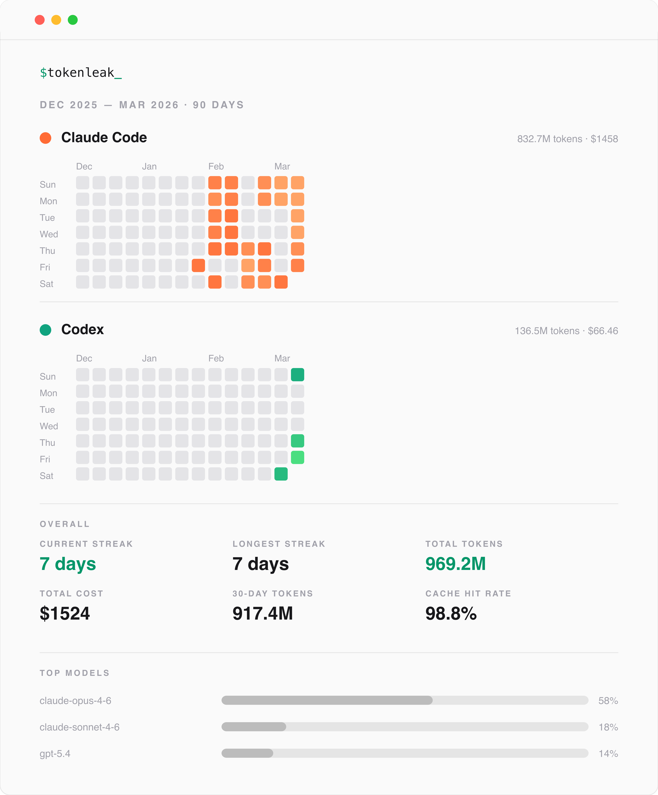

# Tokenleak

See where your AI tokens actually go. Tokenleak reads local usage logs from **Claude Code**, **Codex**, **Pi (`pi-mono`)**, and **OpenCode**, then renders terminal dashboards, heatmaps, compare reports, explain/focus reports, and shareable image cards from the CLI.



## Install

Install Tokenleak with the package manager you already use:

```bash
# Bun
bun install -g tokenleak

# npm
npm install -g tokenleak

# Run without a global install
bunx tokenleak --help
npx tokenleak --help
```

After installing, run `tokenleak` in your terminal. It auto-detects supported providers from their local logs.
In an interactive TTY, plain `tokenleak` opens a launcher where you can:

- render the standard terminal dashboard
- open a tabbed terminal dashboard
- export JSON, SVG, or PNG
- build compare reports
- run explain reports for a specific day
- run focus reports for deep-work sessions
- inspect richer analytics such as model efficiency, cache ROI, session/project drill-downs, and attribution clusters
- start the local live dashboard
- inspect provider availability and aliases

### From source

```bash
git clone https://github.com/ya-nsh/tokenleak.git
cd tokenleak
bun install
bun run build
bun run bundle

# Run directly
bun dist/tokenleak.js
```

## Usage

```bash
# Open the interactive launcher (TTY only)
tokenleak

# Skip the launcher and render directly with flags
tokenleak --format terminal

# Start the local live dashboard server
tokenleak --live-server

# Output as JSON
tokenleak --format json

# Export an SVG heatmap
tokenleak --format svg --output usage.svg

# Export a PNG image
tokenleak --format png --output usage.png

# Save to a file (format is inferred from the extension)
tokenleak -o report.json
tokenleak -o heatmap.svg
tokenleak -o card.png

# Explain one day's usage
tokenleak explain 2026-03-10
tokenleak explain 2026-03-10 --format json

# Rank deep-work sessions
tokenleak focus
tokenleak focus --provider codex --days 30

# Show registered providers, availability, and aliases
tokenleak --list-providers
```

### Analysis commands

Tokenleak ships two dedicated investigation commands in addition to the main dashboard flow:

```bash
# Explain what drove a specific day
tokenleak explain 2026-03-10

# Emit the explain report as JSON
tokenleak explain 2026-03-10 --format json --output explain.json

# Rank sessions by deep-work score
tokenleak focus --days 30

# Focus report as JSON
tokenleak focus --format json --provider pi --output focus.json
```

- `tokenleak explain <date>` builds a narrative day report with top providers, sessions, projects, models, and anomaly flags.
- `tokenleak focus` ranks sessions by a deep-work score derived from duration, token density, and project streak.

### Date filtering

By default, Tokenleak shows the last **90 days** of usage.

```bash
# Last 30 days
tokenleak --days 30

# Specific date range
tokenleak --since 2025-06-01 --until 2025-12-31

# Everything since a date (until defaults to today)
tokenleak --since 2025-01-01

# --since takes priority over --days when both are provided
```

### Provider filtering

Tokenleak auto-detects all installed providers. You can filter to specific ones:

```bash
# Only Claude Code
tokenleak --provider claude-code

# Only Codex
tokenleak --provider codex

# Only Pi
tokenleak --provider pi

# Multiple providers (comma-separated)
tokenleak --provider claude-code,codex,pi

# Provider aliases are supported too
tokenleak --provider anthropic,openai,pi-mono

# Shortcut flags
tokenleak --claude
tokenleak --codex
tokenleak --pi
tokenleak --open-code

# Ignore all provider filters and use every available provider
tokenleak --all-providers
```

### Compare mode

Compare your usage across two time periods to see how your token consumption has changed:

```bash
# Auto-compare: splits your selected date range in half
# (for example, --days 60 compares the last 30 days against the previous 30 days)
tokenleak --compare auto

# Compare against a specific previous period
tokenleak --compare 2025-01-01..2025-03-31

# JSON compare output contains periodA, periodB, and deltas
tokenleak --compare auto --format json

# Compare cards for images use expanded stats automatically
tokenleak --compare auto --format png --output compare.png
```

Compare mode compares the current selection against an earlier period and reports deltas for tokens, cost, streaks, active days, average daily tokens, and cache hit rate.
When you use `--format json`, the output shape is `periodA`, `periodB`, and `deltas`.
When you use `--format png` or `--format svg`, Tokenleak enables expanded compare cards automatically.

### Themes

```bash
# Dark theme (default)
tokenleak --theme dark

# Light theme
tokenleak --theme light
```

### Terminal options

```bash
# Set terminal width (affects heatmap and dashboard layout)
tokenleak --width 120

# Disable ANSI colours (useful for piping output)
tokenleak --no-color

# Hide the insights panel
tokenleak --no-insights

# Add expanded analytics to terminal/image/json output
tokenleak --more
```

With `--more`, Tokenleak surfaces:

- model efficiency scoring with transparent component breakdowns
- prompt-cache ROI analysis by provider, model, and project
- session and project drill-down tables
- attribution clusters that group work by repo/directory and time window

### Sharing

```bash
# Copy rendered output to clipboard
tokenleak --format json --clipboard

# Open the output file in your default application after saving
tokenleak -o usage.svg --open

# If no output path is provided for json/svg/png, Tokenleak uses tokenleak.<format>
tokenleak --format png --open

# Upload to a GitHub Gist (requires gh CLI to be authenticated)
tokenleak --format json --upload gist
```

## Interactive modes

### Launcher

In a real TTY, `tokenleak` opens a launcher instead of rendering immediately. You can move with arrow keys, use number shortcuts, inspect the exact command preview before running it, and stay inside the same session after each command finishes.

### Tabbed terminal dashboard

The launcher can open a full-screen terminal dashboard with:

- time ranges: `7d`, `30d`, `90d`, `365d`
- metric tabs: `overview`, `sess`, `tok`, `model`, `cwd`, `dow`, `tod`
- keyboard navigation for scrolling and switching views

This mode uses event-level data when available, so session, token, project, attribution, model-efficiency, and hour-of-day views are most useful for providers that include session metadata in their local logs.

### Live dashboard

`tokenleak --live-server` starts a local HTTP server that serves an interactive HTML dashboard. The server starts on `http://localhost:3333` and increments the port if needed.

## All flags

When you run bare `tokenleak` in a real terminal, the launcher shows these flags in-app before you run anything.

Subcommands:

- `tokenleak explain <date>` supports `--format terminal|json`, `--output`, `--width`, and the standard provider filters.
- `tokenleak focus` supports `--format terminal|json`, `--output`, `--width`, and the standard provider/date filters.
- `tokenleak explain --help` and `tokenleak focus --help` print the subcommand-specific help text.

| Flag | Alias | Default | Description |
| --- | --- | --- | --- |
| `--format` | `-f` | `terminal` | Output format: `json`, `svg`, `png`, `terminal` |
| `--theme` | `-t` | `dark` | Theme for `png`, `svg`, and live output: `dark`, `light` |
| `--since` | `-s` |  | Start date (`YYYY-MM-DD`). Overrides `--days` |
| `--until` | `-u` | today | End date (`YYYY-MM-DD`) |
| `--days` | `-d` | `90` | Number of trailing days to include |
| `--output` | `-o` | stdout | Output path. Format is inferred from the file extension when possible |
| `--width` | `-w` | `80` | Terminal render width |
| `--provider` | `-p` | auto | Filter to specific provider(s), comma-separated |
| `--claude` |  | `false` | Shortcut for `--provider claude-code` |
| `--codex` |  | `false` | Shortcut for `--provider codex` |
| `--pi` |  | `false` | Shortcut for `--provider pi` |
| `--open-code` |  | `false` | Shortcut for `--provider open-code` |
| `--all-providers` |  | `false` | Ignore provider filters and use every available provider |
| `--list-providers` |  | `false` | Show registered providers, aliases, and availability |
| `--compare` |  |  | Compare against `auto` or `YYYY-MM-DD..YYYY-MM-DD` |
| `--more` |  | `false` | Add expanded PNG/SVG stats and include extra summary data in JSON output |
| `--clipboard` |  | `false` | Copy rendered output to the system clipboard |
| `--open` |  | `false` | Open the rendered file in the default app |
| `--upload` |  |  | Upload output to a service. Supported: `gist` |
| `--live-server` | `-L` | `false` | Start the local browser dashboard |
| `--no-color` |  | `false` | Strip ANSI escape codes from terminal output |
| `--no-insights` |  | `false` | Hide terminal insights |
| `--version` |  |  | Print version information |
| `--help` |  |  | Print usage information |

## Supported providers

### Claude Code

Reads JSONL conversation logs from the Claude Code projects directory. Each assistant message with a `usage` field is parsed for input/output/cache token counts.

|                   |                                              |
| ----------------- | -------------------------------------------- |
| **Data location** | `~/.claude/projects/**/*.jsonl`              |
| **Override**      | Set `CLAUDE_CONFIG_DIR` environment variable |
| **Provider name** | `claude-code`                                |
| **Aliases**       | `anthropic`, `claude`, `claudecode`          |

### Codex

Reads JSONL session logs from the Codex sessions directory. Parses `response` events for token usage with cumulative delta extraction.

|                   |                                       |
| ----------------- | ------------------------------------- |
| **Data location** | `~/.codex/sessions/**/*.jsonl`        |
| **Override**      | Set `CODEX_HOME` environment variable |
| **Provider name** | `codex`                               |
| **Aliases**       | `openai`                              |

### OpenCode

Reads usage data from current OpenCode message storage when available. Falls back to legacy SQLite databases or legacy JSON session files.

|                   |                                                                                                                                                                                        |
| ----------------- | -------------------------------------------------------------------------------------------------------------------------------------------------------------------------------------- |
| **Data location** | `~/.local/share/opencode/storage/message/<session>/*.json` or `~/.config/opencode/storage/message/<session>/*.json` (current), `~/.opencode/opencode.db` or `~/.opencode/sessions.db` (legacy), `~/.opencode/sessions/*.json` (legacy fallback) |
| **Provider name** | `open-code`                                                                                                                                                                            |
| **Aliases**       | `opencode`, `open_code`                                                                                                                                                                |

### Pi

Reads local `pi-mono` session JSONL files. Assistant messages with `usage` metadata are aggregated from the on-disk session history.

|                   |                                                  |
| ----------------- | ------------------------------------------------ |
| **Data location** | `~/.pi/agent/sessions/**/*.jsonl`                |
| **Override**      | Set `PI_CODING_AGENT_DIR` environment variable   |
| **Provider name** | `pi`                                             |
| **Aliases**       | `pi-mono`                                        |

## Output formats

### `terminal` (default)

A rendered terminal dashboard with:

- GitHub-style heatmap using Unicode block characters (`░▒▓█`)
- overview and provider sections with tokens, cost, streaks, rolling totals, and model leaders
- day-of-week breakdown showing which days you code most
- top models ranked by token usage
- model efficiency and cache ROI sections when `--more` is enabled
- session/project drill-down and attribution detail in the tabbed dashboard
- insights such as peak day, top model, and provider mix

Falls back to a compact one-liner when terminal width is under 40 characters.

### `json`

Structured JSON output containing:

```jsonc
{
  "schemaVersion": 1,
  "generated": "2025-12-01T00:00:00.000Z",
  "dateRange": { "since": "2025-09-01", "until": "2025-12-01" },
  "providers": [
    {
      "name": "claude-code",
      "displayName": "Claude Code",
      "daily": [
        {
          "date": "2025-11-30",
          "inputTokens": 15000,
          "outputTokens": 5000,
          "cacheReadTokens": 2000,
          "cacheWriteTokens": 500,
          "totalTokens": 22500,
          "cost": 0.0825,
        },
        // ...
      ],
      "models": [
        {
          "model": "claude-sonnet-4",
          "inputTokens": 10000,
          "outputTokens": 3000,
          "totalTokens": 13000,
          "cost": 0.075,
        },
      ],
      "totalTokens": 22500,
      "totalCost": 0.0825,
    },
  ],
  "aggregated": {
    "currentStreak": 12,
    "longestStreak": 45,
    "totalTokens": 1500000,
    "totalCost": 52.5,
    // ... rolling windows, peaks, averages, day-of-week, top models
  },
  "more": null
}
```

When `--more` is enabled, the `more` field contains expanded metrics such as:

- `inputOutput`, `monthlyBurn`, `cacheEconomics`, and `hourOfDay`
- `modelEfficiency` rankings and ineligible-model reasons
- `cacheRoi` summary plus provider/model/project ROI breakdowns
- `sessionMetrics`, `sessionDrilldown`, and `projectDrilldown`
- `attribution` clusters for repo/directory-oriented work grouping
- compare metadata when applicable

The dedicated analysis commands also support JSON output:

```bash
tokenleak explain 2026-03-10 --format json
tokenleak focus --format json
```

- `tokenleak explain ... --format json` returns an explain report with headline, summary bullets, evidence tables, and anomaly flags.
- `tokenleak focus ... --format json` returns a ranked focus report with deep-work scores, durations, densities, streaks, and rationales per session.

When `--compare` is used with `--format json`, the output is a compare payload with:

```jsonc
{
  "schemaVersion": 1,
  "generated": "2026-03-14T10:15:00.000Z",
  "periodA": { "range": { "since": "2026-02-15", "until": "2026-03-14" }, "stats": {} },
  "periodB": { "range": { "since": "2026-01-18", "until": "2026-02-14" }, "stats": {} },
  "deltas": {
    "tokens": 125000,
    "cost": 4.8,
    "streak": 3,
    "activeDays": 5,
    "averageDailyTokens": 4200,
    "cacheHitRate": 0.08
  }
}
```

### `svg`

A self-contained SVG image with:

- Heatmap grid (7 rows x N weeks) with quantile-based colour intensity
- Month labels and day-of-week labels
- Stats panel and insights panel
- Supports `dark` and `light` themes
- Supports compare cards and expanded stat panels when `--more` is enabled

### `png`

Same layout as SVG, rendered to a PNG image via [sharp](https://sharp.pixelplumbing.com/). Useful for embedding in documents or sharing on platforms that do not support SVG.

With `--more`, PNG output includes expanded stat blocks such as input/output efficiency, projected monthly burn, cache economics, session metrics, hour-of-day activity, and model mix shift for compare renders. The newest drill-down analytics are optimized first for terminal and JSON output.

## Configuration file

Create `~/.tokenleakrc` to set persistent defaults:

```json
{
  "format": "terminal",
  "theme": "dark",
  "days": 90,
  "width": 120,
  "noColor": false,
  "noInsights": false,
  "more": false
}
```

**Priority order** (highest wins): CLI flags > environment variables > config file > built-in defaults.

All fields are optional. Only include the ones you want to override.

## Environment variables

| Variable | Default | Description |
| --- | --- | --- |
| `TOKENLEAK_FORMAT` | `terminal` | Default output format |
| `TOKENLEAK_THEME` | `dark` | Default theme |
| `TOKENLEAK_DAYS` | `90` | Default lookback period in days |
| `TOKENLEAK_MAX_JSONL_RECORD_BYTES` | `10485760` (10 MB) | Max size of a single JSONL record before it is rejected |
| `CLAUDE_CONFIG_DIR` | `~/.claude` | Claude Code configuration directory |
| `CODEX_HOME` | `~/.codex` | Codex home directory |
| `PI_CODING_AGENT_DIR` | `~/.pi/agent` | Pi coding agent directory (sessions live under `sessions/`) |

## What Tokenleak tracks

Tokenleak reads your **local** logs only. It does not send usage data anywhere unless you explicitly use a sharing feature such as `--upload gist`.

For each day of usage, it tracks:

- **Input tokens** — tokens sent to the model
- **Output tokens** — tokens generated by the model
- **Cache read tokens** — tokens served from prompt cache
- **Cache write tokens** — tokens written to prompt cache
- **Cost** — estimated USD cost based on per-model pricing

It then computes:

- **Streaks** — consecutive days with any token usage
- **Rolling 30-day totals** — tokens and cost over a sliding window
- **Peak day** — the single day with the highest token usage
- **Day-of-week breakdown** — which days of the week you use AI most
- **Cache hit rate** — percentage of input tokens served from cache
- **Top models** — models ranked by total token consumption
- **Daily averages** — mean tokens and cost per day
- **Model efficiency** — output-per-dollar, output/input ratio, cache coverage, and a composite score
- **Prompt-cache ROI** — read savings, write cost, net savings, reuse ratio, and payback ratio
- **Session and project drill-downs** — duration, dominant models, active days, and streaks
- **Attribution clusters** — repo/directory-oriented groupings of sessions into investigations or feature work
- **Explain and focus reports** — narrative daily diagnostics and deep-work session rankings


## MCP Server

Tokenleak includes an MCP (Model Context Protocol) server that lets AI coding assistants query your token usage directly. Ask Claude Code, Cursor, or any MCP-compatible client "how much have I spent this week?" and get answers from your local data without leaving the editor.

### Setup

Add the server to your MCP client configuration:

**Claude Code** (`.mcp.json` in your project or `~/.claude/claude_desktop_config.json`):

```json
{
  "mcpServers": {
    "tokenleak": {
      "command": "bun",
      "args": ["run", "/path/to/tokenleak/packages/mcp/dist/index.js"]
    }
  }
}
```

**Cursor** (Settings > MCP Servers):

```json
{
  "mcpServers": {
    "tokenleak": {
      "command": "bun",
      "args": ["run", "/path/to/tokenleak/packages/mcp/dist/index.js"]
    }
  }
}
```

> Replace `/path/to/tokenleak` with your actual clone path. Make sure to run `bun run build` first.

### Available tools

| Tool | Description |
| --- | --- |
| `list_providers` | List all registered providers and their availability |
| `get_usage_summary` | Token/cost summary with streaks, rolling windows, and per-provider breakdown |
| `get_daily_usage` | Day-by-day usage data for trend analysis (default: 14 days) |
| `get_cost_breakdown` | Models ranked by cost with token counts and share percentages |
| `get_streaks_and_habits` | Streaks, day-of-week patterns, peak day, session metrics (default: 90 days) |
| `compare_periods` | Compare two time periods with deltas for tokens, cost, streaks, and cache rate |

All tools accept optional `days`, `since`, and `until` parameters for date filtering. `get_usage_summary` and `get_daily_usage` also accept a `provider` parameter to filter to a specific provider.

### Available resources

| Resource | Description |
| --- | --- |
| `tokenleak://overview` | 30-day usage summary as JSON |
| `tokenleak://provider/{name}` | Per-provider usage data |

### Running the server directly

```bash
# Build first
bun run build

# Start the MCP server (stdio transport)
bun packages/mcp/dist/index.js
```

## Project structure

```
tokenleak/
  packages/
    core/           Shared types, constants, aggregation engine
    registry/       Provider parsers and model pricing
    renderers/      JSON, SVG, PNG, and terminal output
    cli/            CLI entrypoint and config handling
    mcp/            MCP server for AI assistant integration
  scripts/
    build-npm.ts    Bundles CLI for npm publishing
  dist/
    tokenleak.js    Bundled CLI (generated)
```

## Contributing

See [CONTRIBUTING.md](./CONTRIBUTING.md) for development setup, PR workflow, and coding guidelines.

## License

MIT
