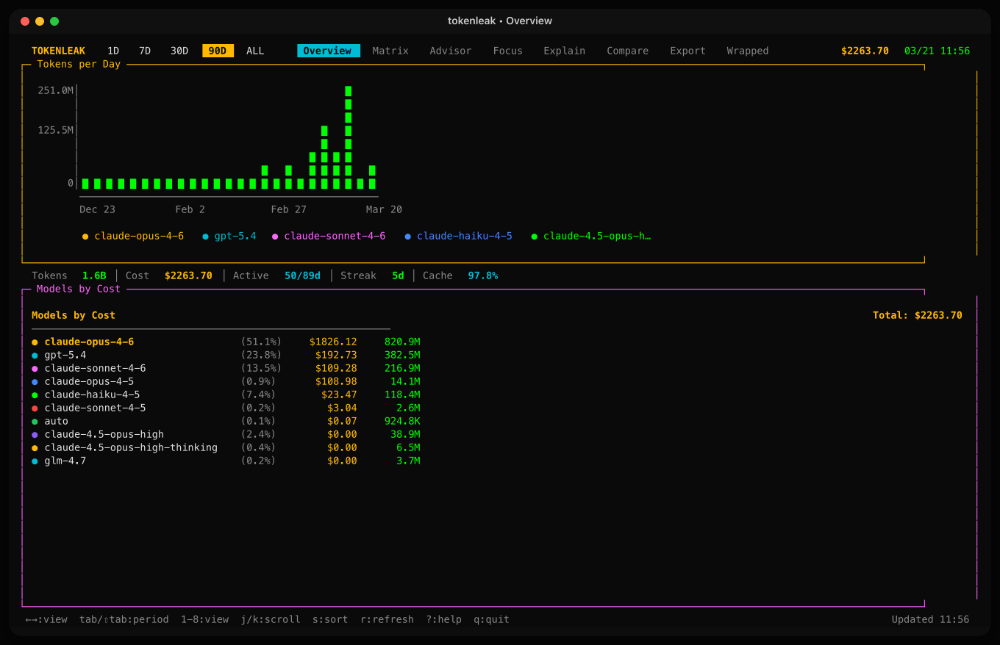
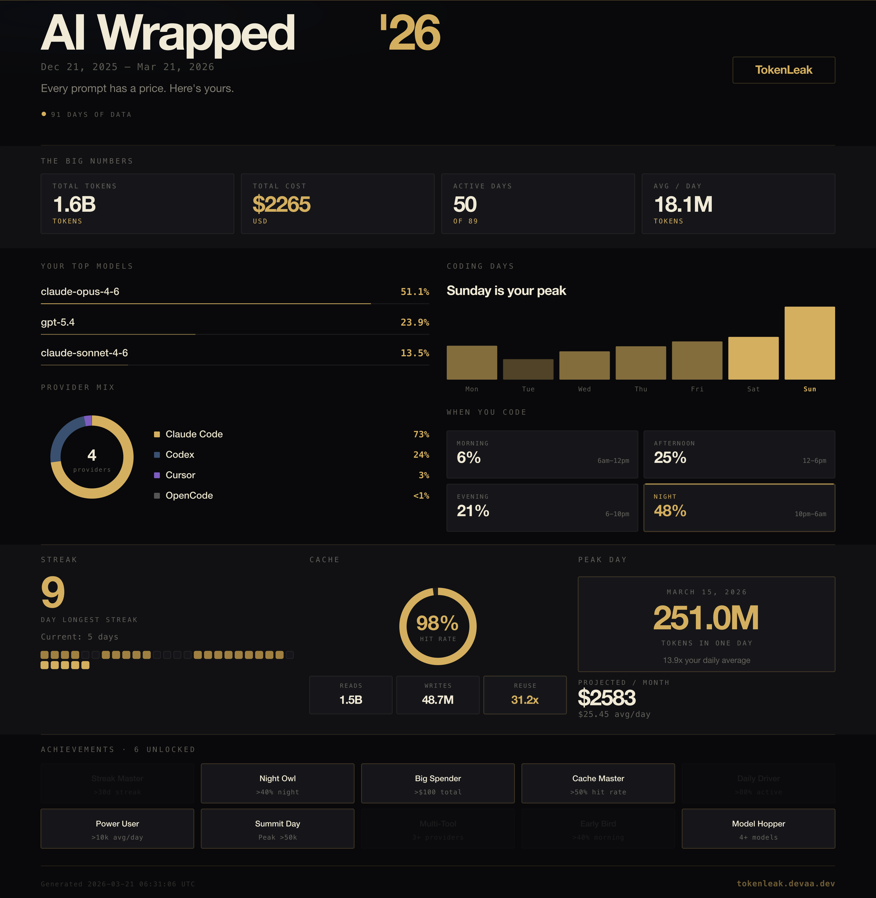
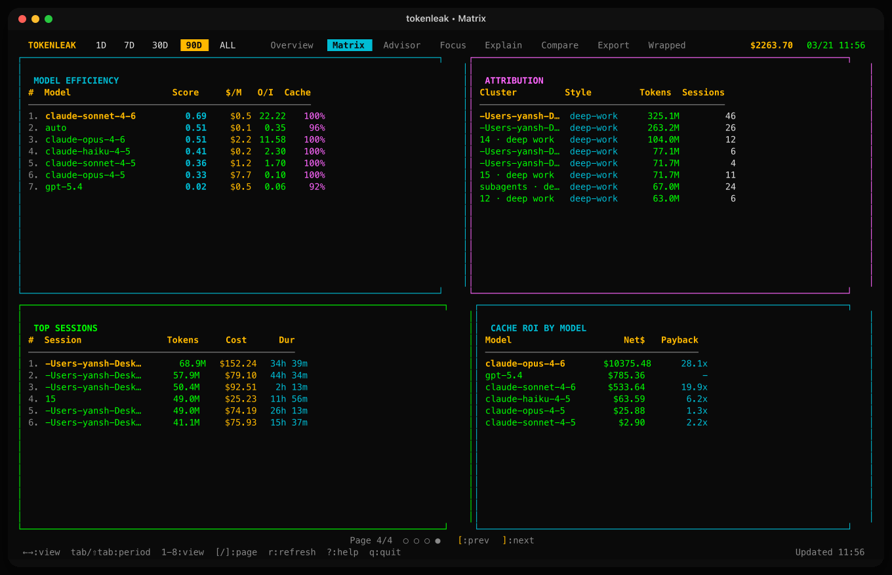
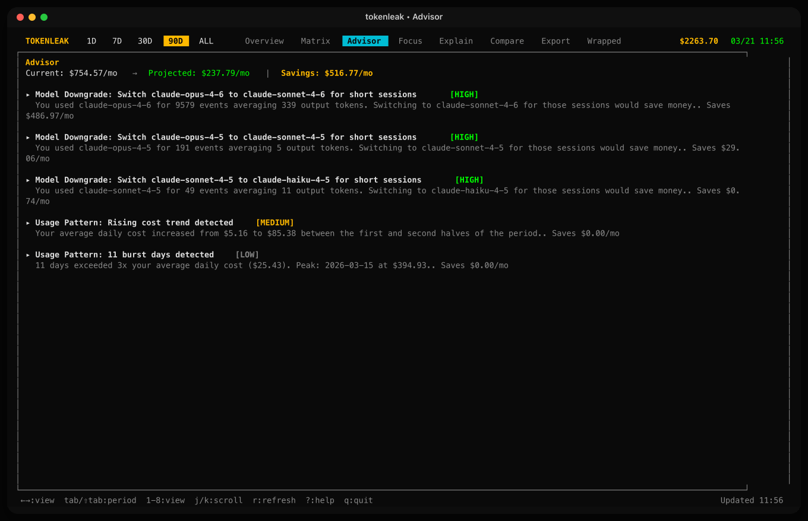
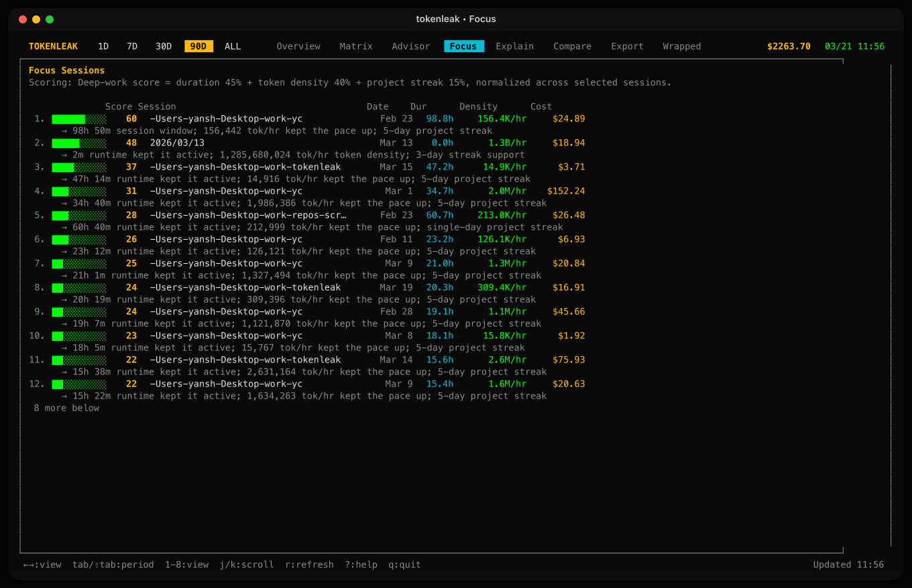
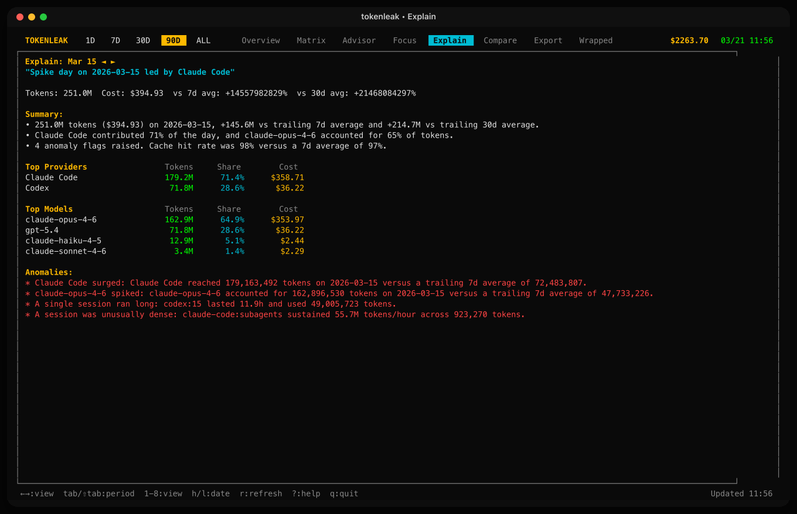
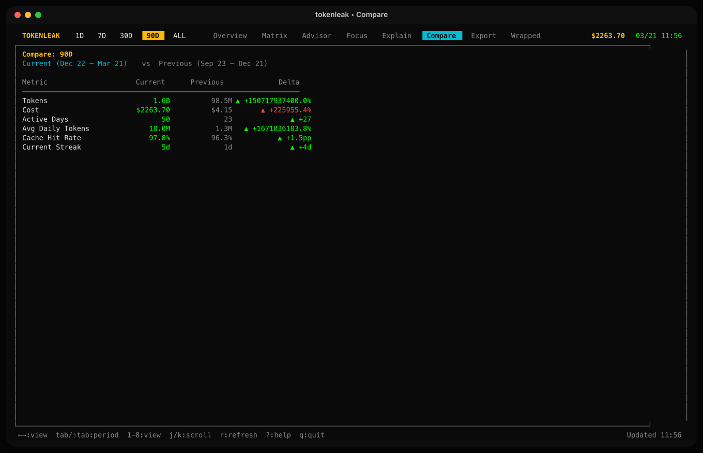
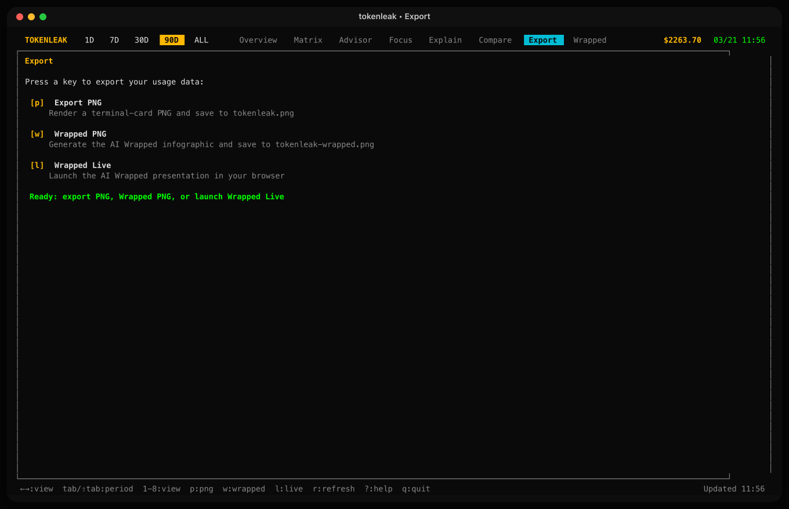
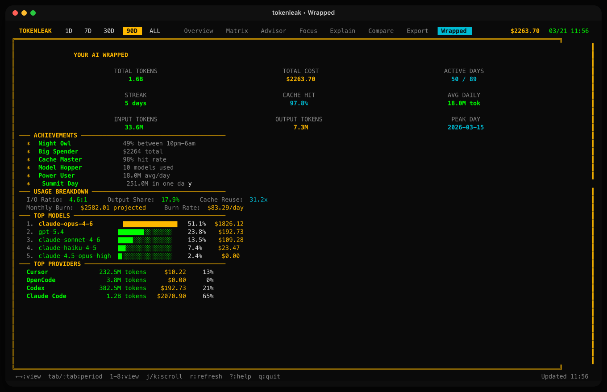

# Tokenleak

See where your AI tokens actually go. Tokenleak reads usage data from **Claude Code**, **Codex**, **Cursor**, **Gemini**, **GitHub Copilot**, **Amp**, **Qwen**, **Roo Code**, **Kilo Code**, **OpenClaw**, **Hermes**, **Pi (`pi-mono`)**, and **OpenCode**, then renders terminal dashboards, heatmaps, compare reports, explain/focus reports, and shareable image cards from the CLI.



## Overview

Tokenleak auto-detects supported providers from their local logs and storage. This is the quick scan of where it looks before it renders dashboards, reports, and images:

| Icon | Client | Local data location | Provider key and aliases | Supported |
| ---- | ------ | ------------------- | ------------------------ | --------- |
|  | Claude Code | `~/.claude/projects/**/*.jsonl` | `claude-code`, `anthropic`, `claude`, `claudecode` | Yes |
|  | Codex | `~/.codex/sessions/**/*.jsonl` | `codex`, `openai` | Yes |
|  | Cursor | `~/.config/tokenleak/cursor-cache/usage*.csv` after `tokenleak cursor login` | `cursor`, `cursor-ide`, `cursoride` | Yes |
|  | Gemini | `~/.gemini/tmp/**/*.{json,jsonl}` | `gemini`, `google` | Yes |
|  | GitHub Copilot | `~/.copilot/otel/**/*.jsonl` | `copilot`, `github-copilot`, `copilot-otel` | Yes |
|  | Amp | `${XDG_DATA_HOME:-~/.local/share}/amp/threads/T-*.json` | `amp`, `sourcegraph-amp` | Yes |
|  | Qwen | `~/.qwen/projects/**/*.jsonl` | `qwen` | Yes |
|  | Roo Code | `~/.config/Code/User/globalStorage/rooveterinaryinc.roo-cline/tasks/**/ui_messages.json` | `roo-code`, `roo`, `roocode` | Yes |
|  | Kilo Code | `~/.config/Code/User/globalStorage/kilocode.kilo-code/tasks/**/ui_messages.json` | `kilo-code`, `kilo`, `kilocode` | Yes |
|  | OpenClaw | `~/.openclaw/agents/**/*.jsonl*` | `openclaw`, `open-claw` | Yes |
|  | Hermes | `${HERMES_HOME:-~/.hermes}/state.db` | `hermes` | Yes |
|  | OpenCode | `~/.local/share/opencode/storage/message/<session>/*.json` or `~/.config/opencode/storage/message/<session>/*.json`<br />Legacy: `~/.opencode/opencode.db`, `~/.opencode/sessions.db`, `~/.opencode/sessions/*.json` | `open-code`, `opencode`, `open_code` | Yes |
|  | Pi (`pi-mono`) | `~/.pi/agent/sessions/**/*.jsonl` | `pi`, `pi-mono` | Yes |

- Use `CLAUDE_CONFIG_DIR` to override the Claude Code base directory.
- Use `CODEX_HOME` to override the Codex base directory.
- Use `TOKENLEAK_CURSOR_DIR` to override the Cursor credentials/cache directory.
- Use `TOKENLEAK_GEMINI_DIR`, `TOKENLEAK_COPILOT_OTEL_DIR`, `TOKENLEAK_AMP_DIR`, `TOKENLEAK_QWEN_DIR`, `TOKENLEAK_ROO_CODE_DIR`, `TOKENLEAK_KILO_CODE_DIR`, `TOKENLEAK_OPENCLAW_DIR`, and `TOKENLEAK_HERMES_DIR` to override the new provider data locations.
- Hermes also honors `HERMES_HOME`.
- Use `PI_CODING_AGENT_DIR` to override the Pi base directory.
- See [Provider details](#provider-details) for the parser behavior and per-provider notes.

## Install

Install Tokenleak with the package manager you already use:

```bash
# Bun
bun install -g tokenleak

# npm
npm install -g tokenleak

# Run without a global install
bunx tokenleak --help
npx tokenleak --help
```

After installing, run `tokenleak` in your terminal. It auto-detects supported providers from their local logs.
In an interactive TTY, plain `tokenleak` launches a full-screen TUI dashboard with 10 views:

- **Overview** — heatmap, stats, providers, and top models
- **Matrix** — 4-page deep-dive with activity patterns, cache economics, sessions, model efficiency, attribution, and cache ROI by model
- **Advisor** — model efficiency recommendations, projected savings, and waste-pattern recipes
- **Focus** — deep-work session rankings scored by duration, density, and streaks
- **Explain** — narrative day-by-day usage breakdown
- **Compare** — side-by-side period comparison with deltas
- **Export** — save PNG, Wrapped PNG, launch a live server, or copy an LLM-ready analysis prompt
- **Wrapped** — Spotify-Wrapped-style stats card with achievements and usage breakdown
- **Replay** — chronological session timeline with flow blocks, pulse chart, and flow/think ratio
- **AI ROI** — token spend versus local Git output, including commits, changed lines, and cost/token ratios per repo

Use `tokenleak --legacy` to open the classic interactive launcher instead.

### From source

```bash
git clone https://github.com/ya-nsh/tokenleak.git
cd tokenleak
bun install
bun run build
bun run bundle

# Run directly
bun dist/tokenleak.js
```

## Usage

```bash
# Open the TUI dashboard (TTY only)
tokenleak

# Open the classic interactive launcher
tokenleak --legacy

# Skip the TUI and render directly with flags
tokenleak --format terminal

# Start the local live dashboard server
tokenleak --live-server

# Output as JSON
tokenleak --format json

# Export an SVG heatmap
tokenleak --format svg --output usage.svg

# Export a PNG image
tokenleak --format png --output usage.png

# Export anonymized aggregate data or an LLM-ready analysis prompt
tokenleak commons export --days 90 --output commons.json
tokenleak commons prompt --days 90 --clipboard
tokenleak commons prompt --provider claude,codex --output tokenleak-llm-prompt.md

# Generate your AI Coding Wrapped story card
tokenleak --format wrapped
tokenleak --format wrapped --theme light --output my-wrapped.png --open

# Launch the interactive AI Wrapped presentation in a browser
tokenleak --wrapped-live
tokenleak --wrapped-live --days 365

# Get model efficiency recommendations
tokenleak --advisor
tokenleak --advisor --days 30 --claude

# Save to a file (format is inferred from the extension)
tokenleak -o report.json
tokenleak -o heatmap.svg
tokenleak -o card.png

# Explain one day's usage
tokenleak explain 2026-03-10
tokenleak explain 2026-03-10 --format json

# Replay a day's session timeline
tokenleak replay
tokenleak replay 2026-03-10 --format json

# Rank deep-work sessions
tokenleak focus
tokenleak focus --provider codex --days 30

# Compare AI token spend against local Git output
tokenleak nutrition
tokenleak nutrition --days 30 --format json

# Authenticate Cursor and sync its local cache
tokenleak cursor login --name work

# Show registered providers, availability, and aliases
tokenleak --list-providers
```

### Analysis commands

Tokenleak ships three dedicated investigation commands in addition to the main dashboard flow:

```bash
# Explain what drove a specific day
tokenleak explain 2026-03-10

# Emit the explain report as JSON
tokenleak explain 2026-03-10 --format json --output explain.json

# Rank sessions by deep-work score
tokenleak focus --days 30

# Focus report as JSON
tokenleak focus --format json --provider pi --output focus.json

# Replay today's session timeline
tokenleak replay

# Replay a specific day with JSON output
tokenleak replay 2026-03-10 --format json --output replay.json

# Estimate AI ROI from token usage and local Git output
tokenleak nutrition --days 30

# Emit the AI ROI report as JSON
tokenleak nutrition --format json --output ai-roi.json
```

- `tokenleak explain <date>` builds a narrative day report with top providers, sessions, projects, models, and anomaly flags.
- `tokenleak focus` ranks sessions by a deep-work score derived from duration, token density, and project streak.
- `tokenleak replay [date]` shows a chronological timeline of all sessions for a day, clustering events into flow blocks with a pulse chart and flow/think ratio. Defaults to today.
- `tokenleak nutrition` powers the TUI **AI ROI** view. It resolves local Git repo roots from provider project paths, runs read-only `git log --numstat`, and reports tokens/cost per commit and changed line. `No Git signal` means Tokenleak saw AI usage for a repo path but found no commits in the selected date window; switch to a wider window or ensure the project path exists locally as a Git worktree.

### Cursor commands

Use these commands to manage Cursor authentication and the local cache that Tokenleak reads:

```bash
tokenleak cursor login --name work
tokenleak cursor status
tokenleak cursor accounts --json
tokenleak cursor switch work
tokenleak cursor logout --name work
tokenleak cursor logout --all --purge-cache
tokenleak cursor reset
```

- Getting a Cursor session token:

  The exact browser wording may vary, but the reliable source of truth is the `WorkosCursorSessionToken` cookie:

  1. Open Cursor and sign in.
  2. Open `https://www.cursor.com/settings`.
  3. Open your browser developer tools.
  4. Go to `Application` (or `Storage`) -> `Cookies` -> `https://www.cursor.com`.
  5. Copy the value of the `WorkosCursorSessionToken` cookie.
  6. Paste that token into `tokenleak cursor login --name <label>` when prompted, or into the TUI setup modal after pressing `c`.

- Local checkout flow:

```bash
# Build once from the repo root
bun install
bun run build

# Validate the saved Cursor session token
bun packages/cli/dist/cli.js cursor status

# Trigger the first Cursor cache sync and show Cursor-only usage
bun packages/cli/dist/cli.js --provider cursor --format terminal

# Inspect raw Cursor data
bun packages/cli/dist/cli.js --provider cursor --format json
```

- Normal dashboard/report runs auto-refresh Cursor cache when you are logged in and Cursor is requested or available.
- If refresh fails but cached CSVs exist, Tokenleak falls back to the cached data.
- `tokenleak cursor status` only validates the saved session token. It does not mark Cursor as available by itself.
- `tokenleak cursor reset` clears saved Cursor credentials and the local Cursor cache so you can re-test the in-TUI setup flow from a clean state.
- `tokenleak --list-providers` reports whether local provider data exists. For Cursor, that means `cursor-cache/usage*.csv` must already be present.
- If `cursor status` is valid but `--list-providers` still shows Cursor as unavailable, run `tokenleak --provider cursor` once to sync the cache, then rerun `--list-providers`.
- Cursor session tokens are stored in plaintext at `~/.config/tokenleak/cursor-credentials.json` (or under `TOKENLEAK_CURSOR_DIR`) with local-only file permissions.

### Date filtering

By default, Tokenleak shows the last **90 days** of usage.

```bash
# Last 30 days
tokenleak --days 30

# Specific date range
tokenleak --since 2025-06-01 --until 2025-12-31

# Everything since a date (until defaults to today)
tokenleak --since 2025-01-01

# --since takes priority over --days when both are provided
```

### Provider filtering

Tokenleak auto-detects all installed providers. You can filter to specific ones:

```bash
# Only Claude Code
tokenleak --provider claude-code

# Only Codex
tokenleak --provider codex

# Only Cursor
tokenleak --provider cursor

# Only Pi
tokenleak --provider pi

# Multiple providers (comma-separated)
tokenleak --provider claude-code,codex,cursor,pi

# Provider aliases are supported too
tokenleak --provider anthropic,openai,cursor-ide,pi-mono

# Shortcut flags
tokenleak --claude
tokenleak --codex
tokenleak --cursor
tokenleak --pi
tokenleak --open-code

# Ignore all provider filters and use every available provider
tokenleak --all-providers
```

### Compare mode

Compare your usage across two time periods to see how your token consumption has changed:

```bash
# Auto-compare: splits your selected date range in half
# (for example, --days 60 compares the last 30 days against the previous 30 days)
tokenleak --compare auto

# Compare against a specific previous period
tokenleak --compare 2025-01-01..2025-03-31

# JSON compare output contains periodA, periodB, and deltas
tokenleak --compare auto --format json

# Compare cards for images use expanded stats automatically
tokenleak --compare auto --format png --output compare.png
```

Compare mode compares the current selection against an earlier period and reports deltas for tokens, cost, streaks, active days, average daily tokens, and cache hit rate.
When you use `--format json`, the output shape is `periodA`, `periodB`, and `deltas`.
When you use `--format png` or `--format svg`, Tokenleak enables expanded compare cards automatically.

### AI Coding Wrapped

Generate a Spotify-Wrapped-style story card as a tall PNG image showing your AI coding stats, streaks, model usage, habits, achievements, and more.

Current wrapped card generated from the latest Tokenleak build:



```bash
# Generate your wrapped card (dark theme, opens automatically)
tokenleak --format wrapped --open

# Light theme, custom output path
tokenleak --format wrapped --theme light --output my-wrapped.png

# Specific date range
tokenleak --format wrapped --since 2025-01-01 --until 2025-12-31
```

The wrapped card includes 12 sections: title, big numbers, streak story, top model donut chart, provider mix, day-of-week bars, time-of-day distribution, cache efficiency gauge, peak day spotlight, earned achievements, monthly burn projection, and footer.

Achievements are computed from your actual data — earn badges like Streak Master (30+ day streak), Cache Master (>50% hit rate), Night Owl (>40% usage 10pm-6am), Power User (>10k avg daily tokens), and more.

The TUI dashboard includes a Wrapped view (press `8` or arrow to it). The classic launcher (`tokenleak --legacy`) also offers a guided Wrapped setup flow.

### Wrapped Live

Launch the AI Wrapped as an interactive 12-slide presentation in your browser with smooth transitions, keyboard/swipe navigation, and progress dots:

```bash
# Start the wrapped live server (opens on localhost:3456)
tokenleak --wrapped-live

# With a full year of data
tokenleak --wrapped-live --days 365 --claude

# Filter to specific providers
tokenleak --wrapped-live --provider claude-code,codex
```

`tokenleak --format wrapped` is the static export path: it writes a tall PNG you can attach to docs, posts, or issues. `tokenleak --wrapped-live` uses the same underlying stats, but serves them as a browser deck that is better for demos, screenshares, and walking through each section interactively.

The Wrapped Live server starts on `http://localhost:3456` and automatically increments to the next free port if `3456` is already taken. The presentation uses the same 12 sections as the static wrapped card but rendered as navigable slides with an obsidian-and-gold design. Use arrow keys, click the nav buttons, or swipe on touch devices to move between slides.

The classic launcher (`tokenleak --legacy`) includes Wrapped Live as a menu option.

### Model Efficiency Advisor

Analyze your usage patterns and get actionable recommendations for reducing costs:

```bash
# Run the advisor (last 90 days by default)
tokenleak --advisor

# Analyze last 30 days, Claude Code only
tokenleak --advisor --days 30 --claude
```

The advisor detects optimization opportunities:

- **Model downgrades** — identifies expensive models used for short outputs and suggests cheaper alternatives with concrete $/month savings
- **Cache optimization** — flags low cache hit rates and poor reuse ratios
- **Usage patterns** — warns about model concentration risk, cost trend increases, and burst days

In the TUI Advisor view, the same screen also includes **Waste Patterns**: deterministic findings such as context drag, burst spikes, wasted cache writes, and model-switch churn. Each finding includes severity, evidence, estimated savings where defensible, and a concrete local recipe for what to try next.

Each recommendation includes current cost, projected cost, monthly savings, and a confidence level (high/medium/low). The advisor is also available as a `get_efficiency_advice` tool in the MCP server.

### Themes

```bash
# Dark theme (default)
tokenleak --theme dark

# Light theme
tokenleak --theme light
```

### Terminal options

```bash
# Set terminal width (affects heatmap and dashboard layout)
tokenleak --width 120

# Disable ANSI colours (useful for piping output)
tokenleak --no-color

# Hide the insights panel
tokenleak --no-insights

# Add expanded analytics to terminal/image/json output
tokenleak --more
```

With `--more`, Tokenleak surfaces:

- model efficiency scoring with transparent component breakdowns
- prompt-cache ROI analysis by provider, model, and project
- session and project drill-down tables
- attribution clusters that group work by repo/directory and time window

### Sharing

```bash
# Copy rendered output to clipboard
tokenleak --format json --clipboard

# Open the output file in your default application after saving
tokenleak -o usage.svg --open

# If no output path is provided for json/svg/png, Tokenleak uses tokenleak.<format>
tokenleak --format png --open

# Upload to a GitHub Gist (requires gh CLI to be authenticated)
tokenleak --format json --upload gist
```

## Interactive modes

### TUI dashboard (default)

In a real TTY, `tokenleak` launches a full-screen terminal dashboard built with [@opentui/core](https://www.npmjs.com/package/@opentui/core). The TUI provides 8 views with keyboard and mouse navigation. The Advisor view includes both savings recommendations and waste-pattern recipes.

Latest OpenTUI screenshots from the current dashboard build:

| Overview | Matrix (page 4) |
| --- | --- |
|  |  |
| Advisor | Focus |
|  |  |
| Explain | Compare |
|  |  |
| Export | Wrapped |
|  |  |

| Key | Action |
| --- | --- |
| `←` / `→` | Switch between views |
| `Tab` / `>` | Next time period (1D → 7D → 30D → 90D → ALL) |
| `Shift+Tab` / `<` | Previous time period |
| `1`–`8` | Jump directly to a view |
| `j` / `k` | Scroll up/down in scrollable views |
| `[` / `]` | Matrix page navigation (in Matrix view) |
| `h` / `l` | Previous/next day (in Explain view) |
| `s` | Toggle sort mode (in Overview) |
| `r` | Refresh data |
| `c` | Open Cursor setup when the dashboard shows a Cursor auth/sync banner |
| `?` | Help overlay |
| `q` | Quit |

When Cursor needs setup, re-authentication, or a cache retry, the TUI shows a contextual banner. Press `c` to open the built-in Cursor setup flow, paste a session token, validate it, and sync usage CSVs without leaving the dashboard.

The Matrix view spans 4 pages:
1. Overview + time windows + providers + top models
2. Hour-of-day, day-of-week, I/O breakdown, monthly burn
3. Cache economics, cache ROI, session metrics, top projects
4. Model efficiency, attribution clusters, top sessions, cache ROI by model

### Classic launcher

`tokenleak --legacy` opens the previous interactive launcher with a numbered menu, command preview, and guided setup flows for exports, wrapped cards, and the live dashboard.

### Live dashboard

`tokenleak --live-server` starts a local HTTP server that serves an interactive HTML dashboard. The server starts on `http://localhost:3333` and increments the port if needed.

## All flags

When you run bare `tokenleak` in a real terminal, the TUI dashboard launches. Pass flags to skip the TUI and render directly.

Subcommands:

- `tokenleak explain <date>` supports `--format terminal|json`, `--output`, `--width`, and the standard provider filters.
- `tokenleak focus` supports `--format terminal|json`, `--output`, `--width`, and the standard provider/date filters.
- `tokenleak commons export` writes anonymized aggregate JSON; `tokenleak commons prompt` writes or copies a Markdown prompt for external LLM analysis; `tokenleak commons inspect <file>` validates a commons JSON export before sharing.
- `tokenleak replay [date]` supports `--format terminal|json`, `--output`, `--width`, and the standard provider filters. Date defaults to today.
- `tokenleak cursor --help` prints the Cursor auth/cache command help text.
- `tokenleak explain --help`, `tokenleak focus --help`, `tokenleak commons --help`, and `tokenleak replay --help` print the subcommand-specific help text.

| Flag | Alias | Default | Description |
| --- | --- | --- | --- |
| `--format` | `-f` | `terminal` | Output format: `json`, `svg`, `png`, `terminal`, `wrapped` |
| `--theme` | `-t` | `dark` | Theme for `png`, `svg`, and live output: `dark`, `light` |
| `--since` | `-s` |  | Start date (`YYYY-MM-DD`). Overrides `--days` |
| `--until` | `-u` | today | End date (`YYYY-MM-DD`) |
| `--days` | `-d` | `90` | Number of trailing days to include |
| `--output` | `-o` | stdout | Output path. Format is inferred from the file extension when possible |
| `--width` | `-w` | `80` | Terminal render width |
| `--provider` | `-p` | auto | Filter to specific provider(s), comma-separated |
| `--claude` |  | `false` | Shortcut for `--provider claude-code` |
| `--codex` |  | `false` | Shortcut for `--provider codex` |
| `--cursor` |  | `false` | Shortcut for `--provider cursor` |
| `--pi` |  | `false` | Shortcut for `--provider pi` |
| `--open-code` |  | `false` | Shortcut for `--provider open-code` |
| `--all-providers` |  | `false` | Ignore provider filters and use every available provider |
| `--list-providers` |  | `false` | Show registered providers, aliases, and availability |
| `--compare` |  |  | Compare against `auto` or `YYYY-MM-DD..YYYY-MM-DD` |
| `--more` |  | `false` | Add expanded PNG/SVG stats and include extra summary data in JSON output |
| `--clipboard` |  | `false` | Copy rendered output to the system clipboard |
| `--open` |  | `false` | Open the rendered file in the default app |
| `--upload` |  |  | Upload output to a service. Supported: `gist` |
| `--live-server` | `-L` | `false` | Start the local browser dashboard |
| `--wrapped-live` |  | `false` | Start the interactive AI Wrapped presentation in a browser |
| `--advisor` |  | `false` | Run the model efficiency advisor |
| `--legacy` |  | `false` | Open the classic interactive launcher instead of the TUI |
| `--no-color` |  | `false` | Strip ANSI escape codes from terminal output |
| `--no-insights` |  | `false` | Hide terminal insights |
| `--version` |  |  | Print version information |
| `--help` |  |  | Print usage information |

## Provider details

### Claude Code

Reads JSONL conversation logs from the Claude Code projects directory. Each assistant message with a `usage` field is parsed for input/output/cache token counts.

|                   |                                              |
| ----------------- | -------------------------------------------- |
| **Data location** | `~/.claude/projects/**/*.jsonl`              |
| **Override**      | Set `CLAUDE_CONFIG_DIR` environment variable |
| **Provider name** | `claude-code`                                |
| **Aliases**       | `anthropic`, `claude`, `claudecode`          |

### Codex

Reads JSONL session logs from the Codex sessions directory. Parses `response` events for token usage with cumulative delta extraction.

|                   |                                       |
| ----------------- | ------------------------------------- |
| **Data location** | `~/.codex/sessions/**/*.jsonl`        |
| **Override**      | Set `CODEX_HOME` environment variable |
| **Provider name** | `codex`                               |
| **Aliases**       | `openai`                              |

### Cursor

Reads Cursor usage CSV exports from the local Tokenleak cache. The cache is populated by authenticating with `tokenleak cursor login`, after which normal runs auto-refresh the CSVs when possible.

`tokenleak cursor status` confirms that your saved session token is valid. Cursor only becomes `[available]` in `tokenleak --list-providers` after the local cache has at least one `usage*.csv` file, usually after the first `tokenleak --provider cursor` run.

|                   |                                                       |
| ----------------- | ----------------------------------------------------- |
| **Data location** | `~/.config/tokenleak/cursor-cache/usage*.csv`         |
| **Override**      | Set `TOKENLEAK_CURSOR_DIR` environment variable       |
| **Provider name** | `cursor`                                              |
| **Aliases**       | `cursor-ide`, `cursoride`                             |

### Gemini

Reads Gemini CLI session JSON, chat JSON, and JSONL usage records from the local Gemini temp directory.

|                   |                                                             |
| ----------------- | ----------------------------------------------------------- |
| **Data location** | `~/.gemini/tmp/**/*.{json,jsonl}`                           |
| **Override**      | Set `TOKENLEAK_GEMINI_DIR` environment variable             |
| **Provider name** | `gemini`                                                    |
| **Aliases**       | `google`                                                    |

### GitHub Copilot

Reads local Copilot OTEL JSONL spans and counts chat spans with `gen_ai.usage.*` token attributes.

|                   |                                                                 |
| ----------------- | --------------------------------------------------------------- |
| **Data location** | `~/.copilot/otel/**/*.jsonl`                                    |
| **Override**      | Set `TOKENLEAK_COPILOT_OTEL_DIR` environment variable           |
| **Provider name** | `copilot`                                                       |
| **Aliases**       | `github-copilot`, `copilot-otel`                                |

### Amp

Reads Sourcegraph Amp thread JSON files and combines usage ledger rows with message-level usage without double-counting matching entries.

|                   |                                                                  |
| ----------------- | ---------------------------------------------------------------- |
| **Data location** | `${XDG_DATA_HOME:-~/.local/share}/amp/threads/T-*.json`          |
| **Override**      | Set `TOKENLEAK_AMP_DIR` environment variable                     |
| **Provider name** | `amp`                                                            |
| **Aliases**       | `sourcegraph-amp`                                                |

### Qwen

Reads Qwen CLI project JSONL logs. Assistant records with `usageMetadata` are parsed for prompt, candidate, thought, and cached-content tokens.

|                   |                                                 |
| ----------------- | ----------------------------------------------- |
| **Data location** | `~/.qwen/projects/**/*.jsonl`                   |
| **Override**      | Set `TOKENLEAK_QWEN_DIR` environment variable   |
| **Provider name** | `qwen`                                          |
| **Aliases**       | None                                            |

### Roo Code and Kilo Code

Reads VS Code extension task logs from `ui_messages.json` and uses sibling `api_conversation_history.json` metadata to recover the selected model.

|                   |                                                                                                  |
| ----------------- | ------------------------------------------------------------------------------------------------ |
| **Roo data**      | `~/.config/Code/User/globalStorage/rooveterinaryinc.roo-cline/tasks/**/ui_messages.json`         |
| **Kilo data**     | `~/.config/Code/User/globalStorage/kilocode.kilo-code/tasks/**/ui_messages.json`                 |
| **Override**      | Set `TOKENLEAK_ROO_CODE_DIR` or `TOKENLEAK_KILO_CODE_DIR` environment variable                   |
| **Provider names** | `roo-code`, `kilo-code`                                                                          |
| **Aliases**       | `roo`, `roocode`, `kilo`, `kilocode`                                                             |

### OpenClaw

Reads OpenClaw agent transcripts and optional `sessions.json` indexes. Model-change and model-snapshot records establish the model for assistant usage rows.

|                   |                                                           |
| ----------------- | --------------------------------------------------------- |
| **Data location** | `~/.openclaw/agents/**/*.jsonl*`                          |
| **Override**      | Set `TOKENLEAK_OPENCLAW_DIR` environment variable         |
| **Provider name** | `openclaw`                                                |
| **Aliases**       | `open-claw`                                               |

### Hermes

Reads aggregated Hermes Agent session rows from the local SQLite state database.

|                   |                                                   |
| ----------------- | ------------------------------------------------- |
| **Data location** | `${HERMES_HOME:-~/.hermes}/state.db`              |
| **Override**      | Set `HERMES_HOME` or `TOKENLEAK_HERMES_DIR`       |
| **Provider name** | `hermes`                                          |
| **Aliases**       | None                                              |

### OpenCode

Reads usage data from current OpenCode message storage when available. Falls back to legacy SQLite databases or legacy JSON session files.

|                   |                                                                                                                                                                                        |
| ----------------- | -------------------------------------------------------------------------------------------------------------------------------------------------------------------------------------- |
| **Data location** | `~/.local/share/opencode/storage/message/<session>/*.json` or `~/.config/opencode/storage/message/<session>/*.json` (current), `~/.opencode/opencode.db` or `~/.opencode/sessions.db` (legacy), `~/.opencode/sessions/*.json` (legacy fallback) |
| **Provider name** | `open-code`                                                                                                                                                                            |
| **Aliases**       | `opencode`, `open_code`                                                                                                                                                                |

### Pi

Reads local `pi-mono` session JSONL files. Assistant messages with `usage` metadata are aggregated from the on-disk session history.

|                   |                                                  |
| ----------------- | ------------------------------------------------ |
| **Data location** | `~/.pi/agent/sessions/**/*.jsonl`                |
| **Override**      | Set `PI_CODING_AGENT_DIR` environment variable   |
| **Provider name** | `pi`                                             |
| **Aliases**       | `pi-mono`                                        |

## Output formats

### `terminal` (default)

A rendered terminal dashboard with:

- GitHub-style heatmap using Unicode block characters (`░▒▓█`)
- overview and provider sections with tokens, cost, streaks, rolling totals, and model leaders
- day-of-week breakdown showing which days you code most
- top models ranked by token usage
- model efficiency and cache ROI sections when `--more` is enabled
- session/project drill-down and attribution detail in the tabbed dashboard
- insights such as peak day, top model, and provider mix

Falls back to a compact one-liner when terminal width is under 40 characters.

### `json`

Structured JSON output containing:

```jsonc
{
  "schemaVersion": 1,
  "generated": "2025-12-01T00:00:00.000Z",
  "dateRange": { "since": "2025-09-01", "until": "2025-12-01" },
  "providers": [
    {
      "name": "claude-code",
      "displayName": "Claude Code",
      "daily": [
        {
          "date": "2025-11-30",
          "inputTokens": 15000,
          "outputTokens": 5000,
          "cacheReadTokens": 2000,
          "cacheWriteTokens": 500,
          "totalTokens": 22500,
          "cost": 0.0825,
        },
        // ...
      ],
      "models": [
        {
          "model": "claude-sonnet-4",
          "inputTokens": 10000,
          "outputTokens": 3000,
          "totalTokens": 13000,
          "cost": 0.075,
        },
      ],
      "totalTokens": 22500,
      "totalCost": 0.0825,
    },
  ],
  "aggregated": {
    "currentStreak": 12,
    "longestStreak": 45,
    "totalTokens": 1500000,
    "totalCost": 52.5,
    // ... rolling windows, peaks, averages, day-of-week, top models
  },
  "more": null
}
```

When `--more` is enabled, the `more` field contains expanded metrics such as:

- `inputOutput`, `monthlyBurn`, `cacheEconomics`, and `hourOfDay`
- `modelEfficiency` rankings and ineligible-model reasons
- `cacheRoi` summary plus provider/model/project ROI breakdowns
- `sessionMetrics`, `sessionDrilldown`, and `projectDrilldown`
- `attribution` clusters for repo/directory-oriented work grouping
- compare metadata when applicable

The dedicated analysis commands also support JSON output:

```bash
tokenleak explain 2026-03-10 --format json
tokenleak focus --format json
tokenleak replay 2026-03-10 --format json
```

- An explain report (`tokenleak explain ... --format json`) includes a headline, summary bullets, evidence tables for providers/models/sessions, and anomaly flags.
- `tokenleak focus ... --format json` produces a ranked focus report with deep-work scores, durations, token densities, project streaks, and per-session rationales.
- Use `tokenleak replay ... --format json` to get a replay report containing flow blocks, a token velocity time series, model switch annotations, and a day summary with flow/think ratio.

When `--compare` is used with `--format json`, the output is a compare payload with:

```jsonc
{
  "schemaVersion": 1,
  "generated": "2026-03-14T10:15:00.000Z",
  "periodA": { "range": { "since": "2026-02-15", "until": "2026-03-14" }, "stats": {} },
  "periodB": { "range": { "since": "2026-01-18", "until": "2026-02-14" }, "stats": {} },
  "deltas": {
    "tokens": 125000,
    "cost": 4.8,
    "streak": 3,
    "activeDays": 5,
    "averageDailyTokens": 4200,
    "cacheHitRate": 0.08
  }
}
```

### `svg`

A self-contained SVG image with:

- Heatmap grid (7 rows x N weeks) with quantile-based colour intensity
- Month labels and day-of-week labels
- Stats panel and insights panel
- Supports `dark` and `light` themes
- Supports compare cards and expanded stat panels when `--more` is enabled

### `png`

Same layout as SVG, rendered to a PNG image via [sharp](https://sharp.pixelplumbing.com/). Useful for embedding in documents or sharing on platforms that do not support SVG.

With `--more`, PNG output includes expanded stat blocks such as input/output efficiency, projected monthly burn, cache economics, session metrics, hour-of-day activity, and model mix shift for compare renders. The newest drill-down analytics are optimized first for terminal and JSON output.

## Configuration file

Create `~/.tokenleakrc` to set persistent defaults:

```json
{
  "format": "terminal",
  "theme": "dark",
  "days": 90,
  "width": 120,
  "noColor": false,
  "noInsights": false,
  "more": false
}
```

**Priority order** (highest wins): CLI flags > environment variables > config file > built-in defaults.

All fields are optional. Only include the ones you want to override.

## Environment variables

| Variable | Default | Description |
| --- | --- | --- |
| `TOKENLEAK_FORMAT` | `terminal` | Default output format |
| `TOKENLEAK_THEME` | `dark` | Default theme |
| `TOKENLEAK_DAYS` | `90` | Default lookback period in days |
| `TOKENLEAK_MAX_JSONL_RECORD_BYTES` | `10485760` (10 MB) | Max size of a single JSONL record before it is rejected |
| `CLAUDE_CONFIG_DIR` | `~/.claude` | Claude Code configuration directory |
| `CODEX_HOME` | `~/.codex` | Codex home directory |
| `TOKENLEAK_CURSOR_DIR` | `~/.config/tokenleak` | Cursor credentials/cache root (`cursor-credentials.json`, `cursor-cache/`) |
| `TOKENLEAK_GEMINI_DIR` | `~/.gemini/tmp` | Gemini CLI temp/session directory |
| `TOKENLEAK_COPILOT_OTEL_DIR` | `~/.copilot/otel` | GitHub Copilot OTEL JSONL directory |
| `TOKENLEAK_AMP_DIR` | `${XDG_DATA_HOME:-~/.local/share}/amp/threads` | Amp thread directory |
| `TOKENLEAK_QWEN_DIR` | `~/.qwen/projects` | Qwen project log directory |
| `TOKENLEAK_ROO_CODE_DIR` | VS Code Roo Code task storage | Roo Code task-log directory |
| `TOKENLEAK_KILO_CODE_DIR` | VS Code Kilo Code task storage | Kilo Code task-log directory |
| `TOKENLEAK_OPENCLAW_DIR` | `~/.openclaw/agents` | OpenClaw agent transcript directory |
| `TOKENLEAK_HERMES_DIR` | `~/.hermes` | Hermes directory containing `state.db` |
| `HERMES_HOME` | `~/.hermes` | Hermes home directory |
| `PI_CODING_AGENT_DIR` | `~/.pi/agent` | Pi coding agent directory (sessions live under `sessions/`) |

## What Tokenleak tracks

Tokenleak reads your **local** logs and caches. For Cursor, Tokenleak can also fetch fresh usage CSVs from Cursor's API after you authenticate with `tokenleak cursor login`; that network step only happens for Cursor and only to refresh the local cache.

For each day of usage, it tracks:

- **Input tokens** — tokens sent to the model
- **Output tokens** — tokens generated by the model
- **Cache read tokens** — tokens served from prompt cache
- **Cache write tokens** — tokens written to prompt cache
- **Cost** — estimated USD cost based on per-model pricing

It then computes:

- **Streaks** — consecutive days with any token usage
- **Rolling 30-day totals** — tokens and cost over a sliding window
- **Peak day** — the single day with the highest token usage
- **Day-of-week breakdown** — which days of the week you use AI most
- **Cache hit rate** — percentage of input tokens served from cache
- **Top models** — models ranked by total token consumption
- **Daily averages** — mean tokens and cost per day
- **Model efficiency** — output-per-dollar, output/input ratio, cache coverage, and a composite score
- **Prompt-cache ROI** — read savings, write cost, net savings, reuse ratio, and payback ratio
- **Session and project drill-downs** — duration, dominant models, active days, and streaks
- **Attribution clusters** — repo/directory-oriented groupings of sessions into investigations or feature work
- **Explain and focus reports** — narrative daily diagnostics and deep-work session rankings


## MCP Server

Tokenleak includes an MCP (Model Context Protocol) server that lets AI coding assistants query your token usage directly. Ask Claude Code, Cursor, or any MCP-compatible client "how much have I spent this week?" and get answers from your local data without leaving the editor.

### Setup

Add the server to your MCP client configuration:

**Claude Code** (`.mcp.json` in your project or `~/.claude/claude_desktop_config.json`):

```json
{
  "mcpServers": {
    "tokenleak": {
      "command": "bun",
      "args": ["run", "/path/to/tokenleak/packages/mcp/dist/index.js"]
    }
  }
}
```

**Cursor** (Settings > MCP Servers):

```json
{
  "mcpServers": {
    "tokenleak": {
      "command": "bun",
      "args": ["run", "/path/to/tokenleak/packages/mcp/dist/index.js"]
    }
  }
}
```

> Replace `/path/to/tokenleak` with your actual clone path. Make sure to run `bun run build` first.

### Available tools

| Tool | Description |
| --- | --- |
| `list_providers` | List all registered providers and their availability |
| `get_usage_summary` | Token/cost summary with streaks, rolling windows, and per-provider breakdown |
| `get_daily_usage` | Day-by-day usage data for trend analysis (default: 14 days) |
| `get_cost_breakdown` | Models ranked by cost with token counts and share percentages |
| `get_streaks_and_habits` | Streaks, day-of-week patterns, peak day, session metrics (default: 90 days) |
| `compare_periods` | Compare two time periods with deltas for tokens, cost, streaks, and cache rate |

All tools accept optional `days`, `since`, and `until` parameters for date filtering. `get_usage_summary` and `get_daily_usage` also accept a `provider` parameter to filter to a specific provider.

### Available resources

| Resource | Description |
| --- | --- |
| `tokenleak://overview` | 30-day usage summary as JSON |
| `tokenleak://provider/{name}` | Per-provider usage data |

### Running the server directly

```bash
# Build first
bun run build

# Start the MCP server (stdio transport)
bun packages/mcp/dist/index.js
```

## Project structure

```
tokenleak/
  packages/
    core/           Shared types, constants, aggregation engine
    registry/       Provider parsers and model pricing
    renderers/      JSON, SVG, PNG, and terminal output
    tui/            Full-screen TUI dashboard (default interactive mode)
    cli/            CLI entrypoint and config handling
    mcp/            MCP server for AI assistant integration
  scripts/
    build-npm.ts    Bundles CLI for npm publishing
  dist/
    tokenleak       Bundled CLI (generated)
```

## Contributing

See [CONTRIBUTING.md](./CONTRIBUTING.md) for development setup, PR workflow, and coding guidelines.

## License

MIT
